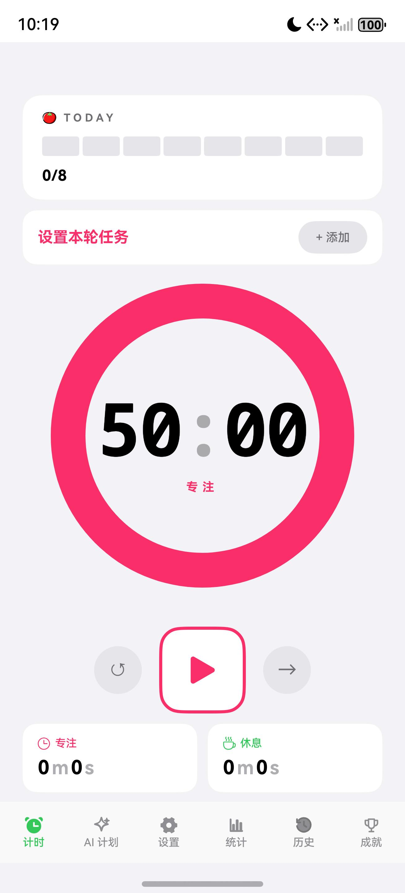
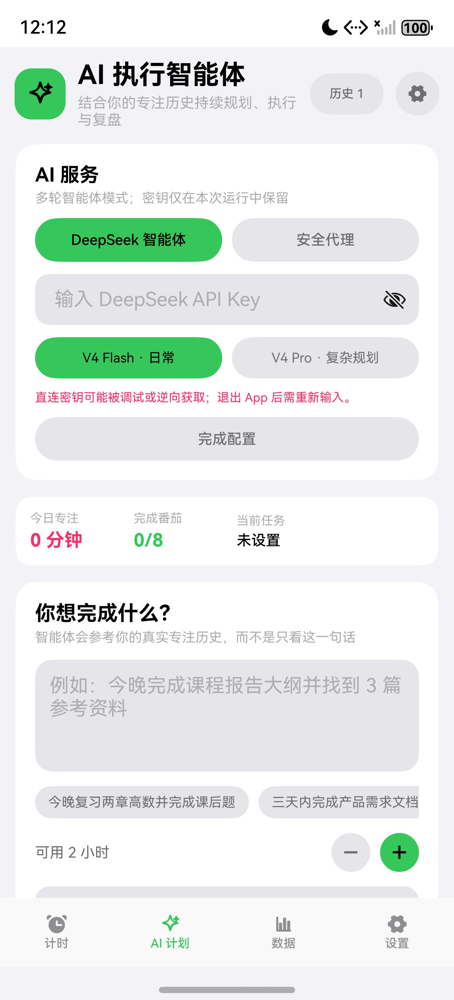
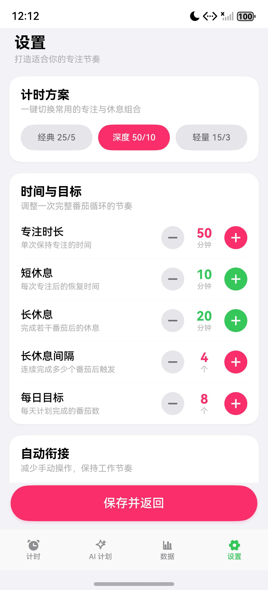
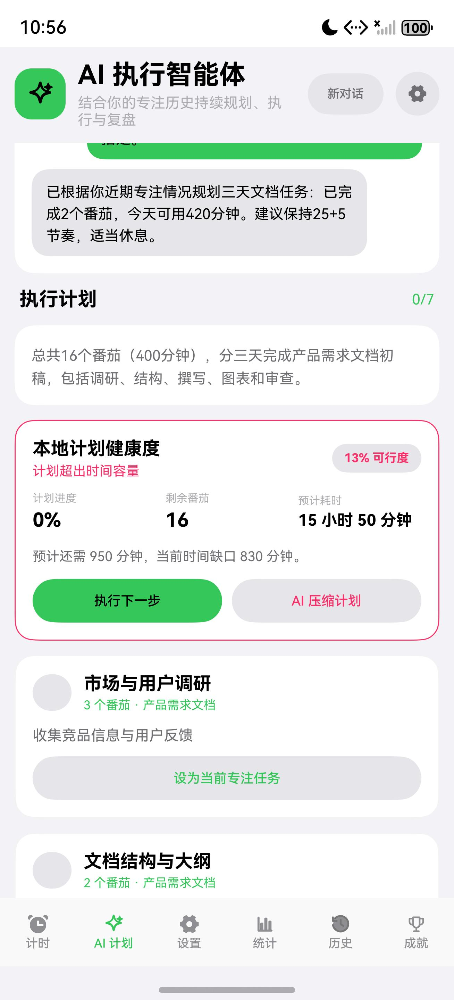
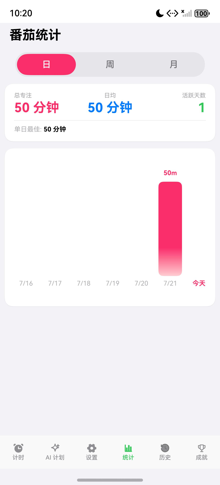
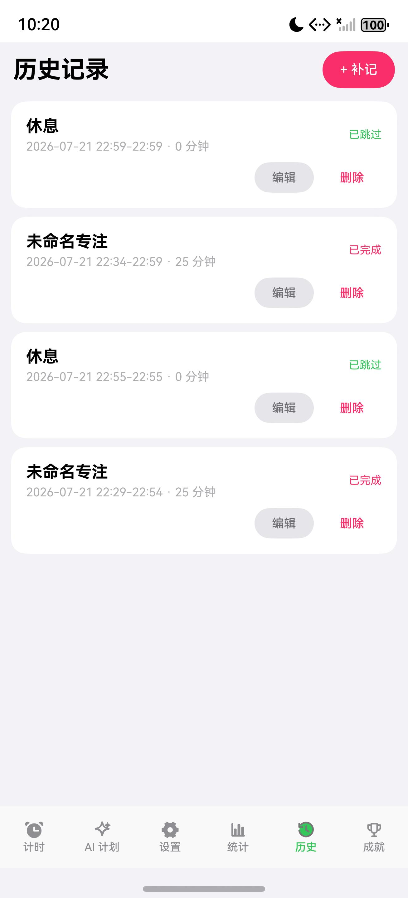
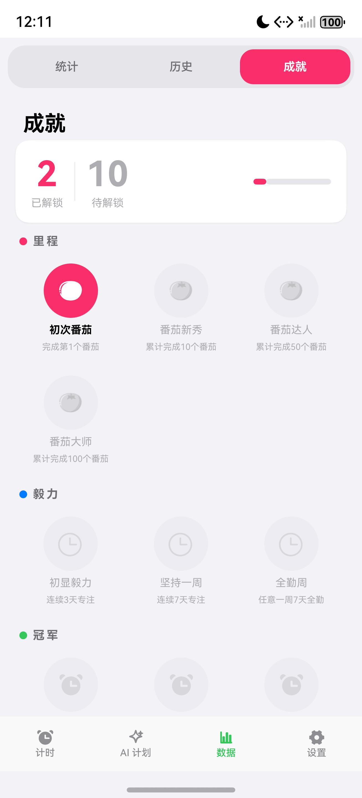

# 番茄钟 - HarmonyOS 智能专注助手

一款使用 ArkTS 与 ArkUI 开发的 HarmonyOS 番茄钟应用。项目将计时、任务、历史、统计、成就与 AI 规划组合成完整的专注执行闭环。

当前版本：`1.1.0`。仓库同时提供源码、自动化测试、真实模拟器截图、未签名 HAP 和完整项目说明，便于评审和复现。

## 功能概览

- 专注、短休息和长休息计时，支持分别设置自动衔接规则
- 经典、深度和轻量三套计时方案
- 当前任务、项目、标签、备注与预计番茄数
- 提前结束时可选择按实际时间或按完整阶段计入统计
- 历史记录查看、补记、编辑和二次确认删除
- 日、周、月专注统计与成就系统
- 通知栏倒计时、结束通知、振动、提示音和三种白噪音
- 深色与浅色主题、音量控制和设置持久化
- DeepSeek 多轮执行智能体：结合真实专注数据生成计划、应用任务、跟踪完成状态并复盘
- 本地计划健康度：按番茄工作量计算加权进度、预计耗时、时间缓冲与超载风险
- 超载时一键要求 AI 压缩计划，健康度卡片可直接执行下一步
- AI 对话历史归档与恢复，保留可用时间、截止条件和步骤进度
- 智能体长短期记忆：透明展示近 7 天专注节奏、本轮主目标、计划进度和下一步
- 目标偏移检测：新指令与主目标关联较弱时先提示，并可按主目标一键校准
- 执行偏差重排：真实计时与步骤估时偏差超过 25% 时，建议按实际速度重排
- 可配置自动复盘：默认关闭，完成步骤后可自动调用 DeepSeek，并明确提示 Token 成本
- API Key 仅保留在运行内存中
- 底部导航精简为“计时 / AI 计划 / 数据 / 设置”四页，统计、历史与成就在数据页内集中切换
- 情境化“下一步建议”：只在目标偏移、执行偏差、待复盘、超载或请求失败时出现，并解释原因和结果
- 失败请求原样重试、异常状态自动收束；已有计划无需联网也能继续执行
- 弱网演示兜底：AI 请求失败时可按目标、可用时间和番茄参数生成明确标注的本地应急计划，联网后可一键交给 AI 优化
- AI 步骤执行跟踪：应用步骤时建立独立进度起点，只统计之后完成的番茄，避免同名历史任务导致步骤误完成
- 部分进度反馈：多番茄步骤会显示真实完成量，并即时更新计划进度、剩余耗时和容量风险
- 本地计划质检：生成后检查时间容量、重复步骤、完成标准、安排原因与交付闭环，并可一键让 AI 修正
- 目标与计划质量门：空泛目标先追问，不消耗 API；不合格计划不覆盖当前版本，DeepSeek 自动修复一次后仍不合格则停止
- DeepSeek 配置诊断：不发送目标和对话内容即可检查密钥、余额可用状态与所选模型，分别提示常见故障
- AI 步骤完成承接：只回写任务来源的同一对话；计时页完成后直接提示下一步，可一键设为后续任务或前往复盘
- AI 计划安全回退：模型确实改动已有计划时自动保留单级快照，支持不调用 AI 一键恢复上版，并随会话历史持久化
- HarmonyOS 跨设备接续原型：可在手机、平板和 2in1 设备间迁移当前倒计时、任务、Agent 计划与近期专注记录

## 应用界面

<p align="center">
  
  
  
</p>

<p align="center">
  
</p>

## 评审快速入口

| 评分项 | 可直接检查的证据 |
|---|---|
| 创新性 | AI 多轮执行、真实专注数据上下文、本地计划健康度、超载预警与闭环复盘 |
| 完备度 | 4 个清晰主 Tab、数据中心三分区、Agent 记忆、计划回退、弱网兜底、跨设备接续、历史修正、会话恢复、44 项核心单元测试 |
| 前景评估 | [项目说明第九章](说明文档.md#九产品前景与社会价值)中的用户、社会价值、商业路径与风险分析 |
| 规范性 | 分层 ArkTS 源码、README、隐私说明、版本记录、测试矩阵、真实截图和 PDF |
| 实际应用价值 | [版本化未签名 HAP](output/hap/Pomodoro-1.1.0-unsigned.hap)、完整源码和五分钟演示脚本 |

<p align="center">
  
  
  
</p>

## 技术栈

| 层级 | 技术 |
|---|---|
| UI | ArkUI 声明式 UI、ArkTS、V1 状态管理 |
| 数据 | ArkData Preferences |
| 网络 | Network Kit HTTP Client |
| 系统能力 | Notification Kit、Sensor Service Kit、Media Kit、Ability Kit |
| AI | DeepSeek Chat Completions JSON Output；可选 OpenAI 服务端代理 |
| 架构 | `pages / views / components / utils / common` 分层 |

## 开发环境

- DevEco Studio 6.0.2
- HarmonyOS SDK API 22
- Node.js 18 或更高版本（仅 AI 代理需要）

## 快速运行

1. 使用 DevEco Studio 打开项目根目录。
2. 等待 Hvigor 与依赖同步完成。
3. 选择 HarmonyOS 模拟器或真机。
4. 运行 `entry` 模块。

命令行构建示例：

```powershell
hvigorw --mode module -p product=default assembleHap --no-daemon
```

构建产物默认位于：

```text
entry/build/default/outputs/default/entry-default-unsigned.hap
```

仓库中的可复现交付版本位于：

```text
output/hap/Pomodoro-1.1.0-unsigned.hap
```

HAP 与 PDF 的 SHA-256 校验值见 [`output/CHECKSUMS.sha256`](output/CHECKSUMS.sha256)。

项目未提交个人签名配置，因此命令行构建默认输出未签名 HAP。安装到真机前需在 DevEco Studio 中配置签名。

## 使用 DeepSeek 智能体

1. 进入“AI 计划”。
2. 打开右上角服务设置。
3. 选择 V4 Flash 或 V4 Pro，输入 DeepSeek API Key。
4. 点击“检查密钥、余额与模型”，确认现场网络和账号配置正常。
5. 描述目标、可用时间与截止时间，生成执行计划。
6. 查看本地健康度、预计耗时和容量风险，必要时让 AI 压缩计划。
7. 执行下一步；达到预计番茄数后，计时页会提示后续步骤，可一键承接或进入 AI 页面复盘。需要自动复盘时，可在服务设置中主动开启。

如果现场网络或 AI 服务暂时不可用，可在失败建议中选择“使用本地应急计划”。该计划不会冒充 AI 结果，页面会持续显示“本地应急”标识；网络恢复后可点击“联网后让 AI 优化这份应急计划”。

安全说明：DeepSeek API Key 不写入 Preferences，也不会进入 AI 对话历史；退出应用后需要重新输入。客户端直连适合个人演示和开发，正式发布建议使用带鉴权、限流与日志脱敏的服务端代理。

## Agent 改进优先级

| 优先级 | 状态 | 能力 |
|---|---|---|
| P0 | 已完成 | 本地状态判断、下一步推荐、Token 消耗提示、失败重试和异常恢复 |
| 复赛质量门 | 已完成 | 空泛目标追问、计划硬性验收、DeepSeek 单次自动修复和不合格版本隔离 |
| P1 | 已完成 | 长短期记忆摘要、目标偏移检测、基于执行偏差的主动重排、可配置自动复盘和情境化建议 |
| 复赛可靠性 | 已完成 | 弱网/服务失败时生成本地应急计划、来源显式标注、恢复联网后一键 AI 优化 |
| P2 | 原型完成 | HarmonyOS 应用接续可迁移计时、任务、Agent 当前状态和近期记录；真机联调仍需签名与可信设备组网 |
| P2 | 后续扩展 | 日历与待办工具、后台提醒、实时多端同步，以及获得用户授权后的多工具编排 |

## 跨设备接续

在系统的应用接续入口选择另一台可信设备后，应用会传递一个受大小限制的状态快照。目标设备按原始绝对截止时间恢复倒计时，因此迁移耗时不会让计时停住；任务上下文、当前 Agent 计划、最近 8 条对话和最近 50 条专注记录一并恢复。

接续数据带有版本号和唯一传输标识，目标端会校验格式、拒绝超大载荷，并对重复传输和历史记录去重。DeepSeek API Key 不进入快照。该能力属于 HarmonyOS 应用接续，不是多个设备同时编辑的实时云同步；完整操作条件与验证清单见 [跨设备接续说明](docs/CROSS_DEVICE_CONTINUATION.md)。

## 可选 AI 代理

`ai-proxy/` 提供一个最小 OpenAI Responses API 代理，密钥只保存在服务端环境变量中：

```powershell
$env:OPENAI_API_KEY = "你的 API Key"
node .\ai-proxy\server.mjs
```

健康检查：`GET http://127.0.0.1:8787/health`。详细配置见 [ai-proxy/README.md](ai-proxy/README.md)。

## 测试与验证

本地单元测试覆盖：

- 后台截止时间换算与向上取整
- 完成、放弃、跳过和休息记录的统计兼容性
- 长休息触发周期与异常间隔
- 专注/休息的独立自动开始规则
- 计划健康度、加权进度、预计耗时和超载风险
- 智能体长短期记忆、目标偏移判断和执行偏差阈值
- 目标校准与基于真实耗时的主动重排决策
- 本地应急计划的时间容量计算、最小可交付步骤与收尾预留
- AI 步骤从应用时刻开始的独立番茄进度统计
- 多番茄步骤的部分进度、剩余耗时和容量风险联动
- 本地计划质检的优质计划识别与多风险提示
- DeepSeek 连接诊断的成功、余额不足和模型不可用状态
- AI 步骤完成后的下一步选择，以及手动任务、跨对话任务不会误推进计划
- AI 计划快照的差异识别、深拷贝与空计划过滤
- 跨设备状态的绝对截止时间保持、数据格式校验与历史幂等合并

```powershell
hvigorw test -p module=entry
```

当前验证结果：`44/44` 单元测试通过，`assembleHap` 构建通过。

完整手动验证矩阵、架构说明、评分点映射与产品前景分析见 [项目说明文档](说明文档.md)，排版版 PDF 见 [项目说明文档 PDF](output/pdf/番茄钟项目说明文档.pdf)。

## 项目结构

```text
entry/src/main/ets/
├── common/       # 常量与 Preferences Key
├── components/   # 环形进度、计时控制、庆祝动画等组件
├── pages/        # 应用入口和全局计时状态机
├── utils/        # 持久化、通知、音频、AI、成就与计时辅助逻辑
└── views/        # AI、设置、数据聚合、统计、历史和成就页面
```

## 文档

- [完整项目说明](说明文档.md)
- [PDF 版项目说明](output/pdf/番茄钟项目说明文档.pdf)
- [AI 代理说明](ai-proxy/README.md)
- [跨设备接续说明](docs/CROSS_DEVICE_CONTINUATION.md)
- [隐私与数据说明](PRIVACY.md)
- [版本更新记录](CHANGELOG.md)
